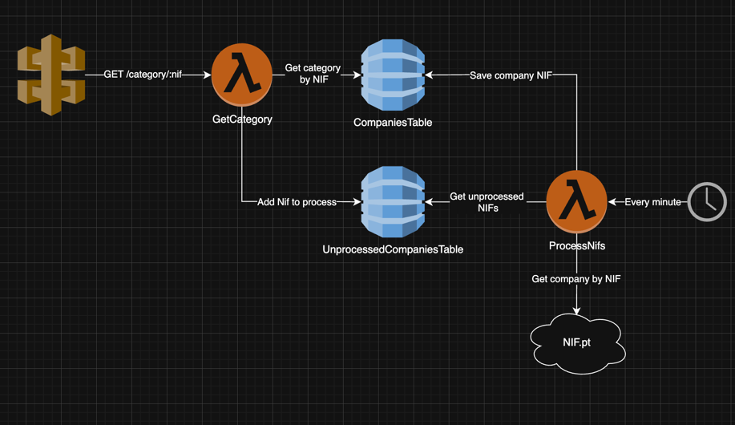

# Efatura-amigo backend

An AWS-based stack that stores NIFs from Portuguese companies along with their corresponding e-Fatura category.  
This service is used by my [Efatura Amigo browser extension](https://github.com/PedroS11/efatura-amigo) to help
automatically select the most appropriate category when validating invoices on the e-Fatura portal.

## Stack

The stack provides two main functionalities:

- **Category lookup by NIF**
    - Returns the category associated with a given NIF
    - If the NIF is not found, it is added to the database for later processing

- **Scheduled processing (cron Lambda)**
    - Runs every minute and calls NIF.pt to retrieve the company’s CAE
    - Maps the CAE to the corresponding e-Fatura category
    - Due to NIF.pt’s free usage limits, only one NIF can be processed per minute
